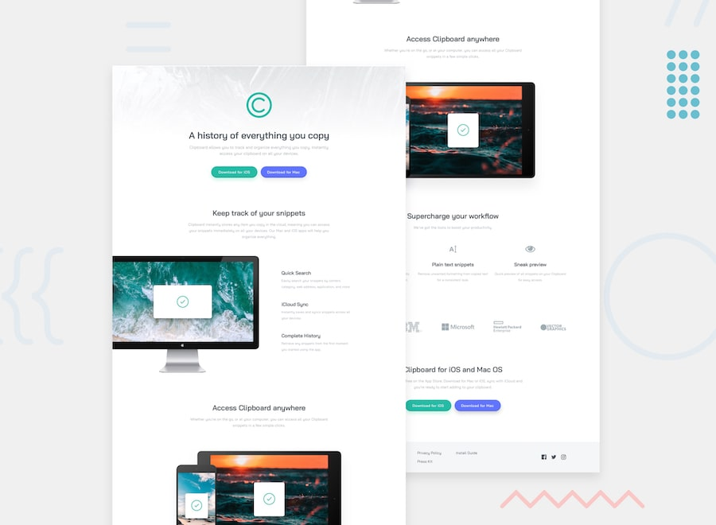

<h1>🚀 Frontend Mentor - Clipboard Landing Page Solution</h1>

This is my solution to the Clipboard landing page challenge on Frontend Mentor.
This project helped me practice responsive layouts and improve my HTML and CSS skills.

<h1>📌 Overview</h1>

<h2>The Challenge</h2>

<ul>
<li>View the optimal layout depending on the user's screen size</li>
<li>See hover states for all interactive elements</li>
</ul>

<h2>📸 Screenshot</h2>

<h2>🔗 Links</h2>

<ul>
<li><a href="https://www.frontendmentor.io/solutions" target="_blank">Solution URL</a></li>
<li><a href="https://your-live-site-url.com" target="_blank">Live Site URL</a></li>
</ul>

<h1>⚙️ My Process</h1>

<h2>🛠 Built With</h2>

<ul>
<li>Semantic HTML5</li>
<li>CSS</li>
<li>Flexbox</li>
<li>Responsive Design</li>
<li>Media Queries</li>
</ul>

<h2>📚 What I Learned</h2>

While building this project, I improved my understanding of responsive layouts
and page structure. I practiced using Flexbox to align elements and organize
different sections of the page.

I also implemented hover effects to make buttons interactive and improve user experience.

<pre><code>
.btngreenbutton:hover{
  transform: scale(1.1);
  transition: all .3s ease;
}
</code></pre>

<h2>🚧 Continued Development</h2>

<ul>
<li>Write cleaner and more semantic HTML</li>
<li>Improve responsive design skills</li>
<li>Learn more JavaScript</li>
<li>Build more real-world frontend projects</li>
</ul>

<h2>📖 Useful Resources</h2>

<ul>
<li>Frontend Mentor challenges helped me practice real-world layouts.</li>
<li>Google Fonts helped me use the Bai Jamjuree font.</li>
</ul>

<h1>👨‍💻 Author</h1>

<ul>
<li><strong>Name:</strong> Abdullah Zulfiqar</li>
<li><a href="https://www.frontendmentor.io/profile/yourusername" target="_blank">Frontend Mentor</a></li>
<li><a href="https://github.com/yourusername" target="_blank">GitHub</a></li>
</ul>